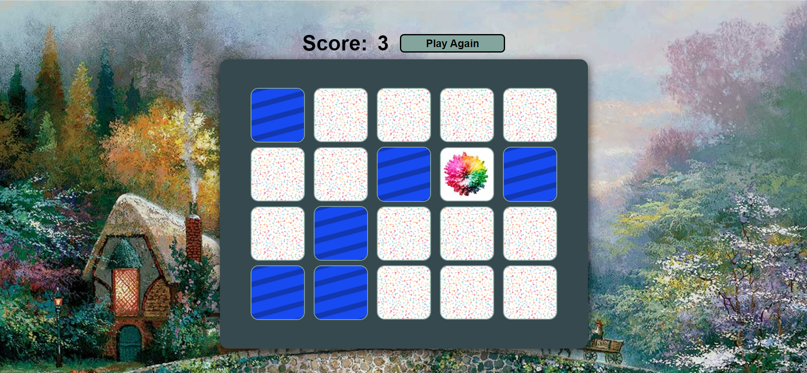

# Memory Game

## Description
This application is a simple flipcards memory game powered by Javascript. This user is meant to choose 2 cards at a time, matching up images to eliminate cards until the board has been entirely eliminated.

## Application
You can visit the deployed application and play the game here: [Memory Game](https://samvrny.github.io/memorygame/)

Here is a shot of the deployed application:

## Technologies Used
* HTML
* CSS
* Javascript
* Google Fonts

## Contributing
Made By Samuel Varney